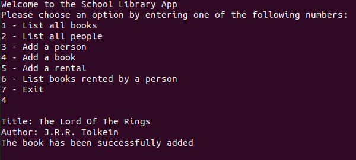

# OOP-school-library

A command line application for a school library.

## Screenshot

## Built With

- Ruby

## Build Instructions

Clone the repository
Run `ruby main.rb`

## Authors

👤 **Cerdtruir**

- GitHub: [@Cerdtruir](https://github.com/Cerdtruir)
